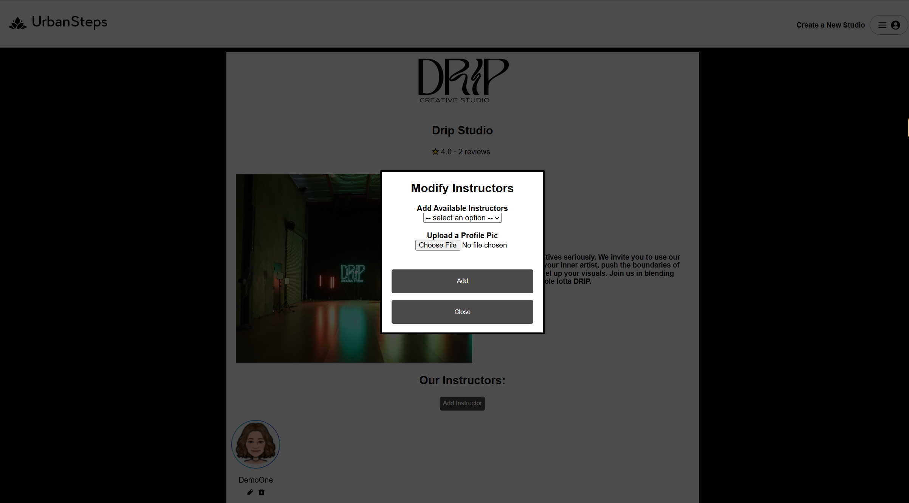

# Urban Steps

Click the following link: [Urban Steps](https://urbansteps.onrender.com/)

Urban Steps is a website and online directory that helps people discover and get involved in local dance studios in their area. Urban Steps' users can view dance studios, instructors, classes, and write reviews. Studio owners can add instructors to their studios and be able to have class schedules on here too! This website is perfect for studio owners who do not have their own website as they can display class schedules for their respective dance studios. This website is also perfect for studio owners who already have a website as it can be another avenue of discovery for people who are interested in taking classes. The backend of Spirited Get Away is built on SQL, sequelize, and express with a PostgreSQL database. Frontend rendering is handled with React and Redux.

## How to clone

To clone this repo as `<new-project-name>`, run

```shell
git clone git@github.com:dianapnle/UrbanSteps.git <new-project-name>
```

in the directory where you want the new project to appear.

## How to install and run

Once the repo is cloned, to setup backend:

`cd <new-project-name>`, then `cd backend && npm install` \
`npx dotenv sequelize db:migrate`\
`npx dotenv sequelize-cli db:seed:all`

to setup frontend:
`cd <new-project-name>` then `cd frontend && npm install`

to install
dependencies.

To run the app, type `npm start` in the backend directory and `npm run dev` in the frontend directory.

## Features & Implementation

#### React router and components

Urban Steps is single page app. The React router handles the logic associated with component navigation and updates accordingly to the root route. The child components are done through React.

#### Frontend and Backend Interaction

Urban Steps server is currently limited to posting data and modification of the database. The frontend stores retrieves and stores necessary information for rendering the site upon entry. There are seed data in the database which can be retrieved and modified, and new information can be passed to be stored into the database as well. The current application is limited to CRUD of studios and instructors. The backend has more functionalities with changes to classes, class events, reviews, and bookings but have not been implemented to interact with the frontend currently.

#### Authentication

Users of the site are required to sign up if they would like to post a review or create a studio. Users can see studio details but will not see additional functionalities that include creating a studio. Upon account creation, the user passwords are hashed with B-crypt before being stored. Authentication uses B-crypt to match passwords which allow a user to login if the passwords match.

#### CRUD

##### Studios

Studios are the core of Urban Steps. All functionalities center around them. The studio table has columns for `ownerId, name, logo, pic, and description`. With the exception of the ownerId, all the other inputs are from the user. The owner_id is a foreign key that points to the associated owner.


Urban Steps lets studio owners create, read, update, and destroy studios. React components and functionalities have been implemented for each corresponding action in the app. Information needed for all components or users actions are managed with redux states.

Users can update the details of the studio that they own as well as delete it under a `manage your studios` link. The link has a list of studios that the user has made along with update or delete functionalities. Once an update or delete has been made:

Update:
1. An update studio form will appear with values pre-populated into the input boxes. Users can change details accordingly.
2. When user clicks update, a call is made to the backend to update the details in the database. Then, the store receives the studio's updated details, and then re-renders to display the studio's details and all associated details.

Delete:
1. A user can delete a studio with a click of a button. This delete button will prompt the user to reconfirm if the user wants to delete the studio or not.
2. If no, the modal will close and the studio will remain under manage studio. If yes, there will be a call made to the backend to delete the studio. Once the store receives the changes in the user's studios, the manage studios browser will re-render and remove the studio that was just deleted and close the modal.

##### Instructors

Urban Steps also lets studio owners to add instructors to the studios that they own. Heading over to "manage studios" link, under a studio that they own,there will be three links. One to edit the studio, one to delete the studio, and one that is labeled "Edit Instructors". Clicking that button opens a modal with a text box to add instructors to the studio. The available instructors to add are users who indicate that they are an instructor upon signing up. The instructors will be added under the studio in the studio detail page.

Example Create Instructor


Once an instructor has been made, the new instructor is quickly added under the studio's list of instructors displayed beneath and removed from the list of available instructors to add. It is done by the following:

1. After the instructor is selected to be added, a call is made to the backend which checks if the instructor is already an instructor for this studio and if the user's input is validated.
2. If successful, when the store receives the studio's updated details and list of instructors, it then re-renders to display the added instructors.

#### New Features Queue

Some features missing from this current app that will hopefully be implemented at a future date:

- CRUD reviews
- CRUD classes
- CRUD class events/schedule
- CRUD class bookings
